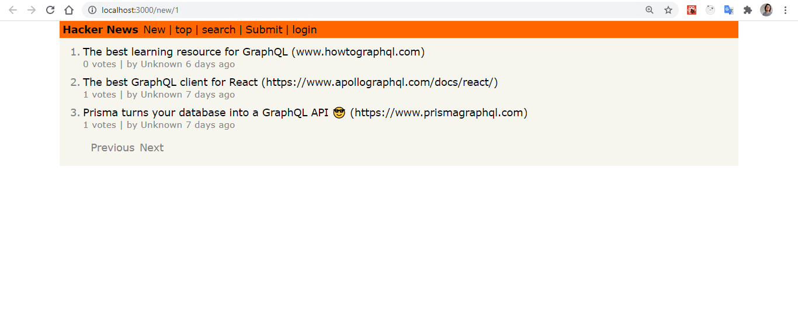
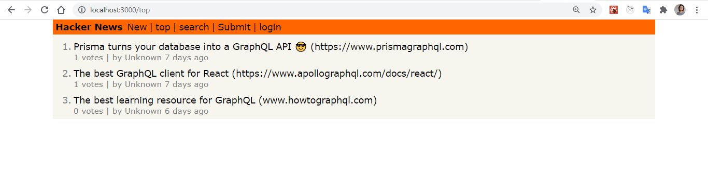
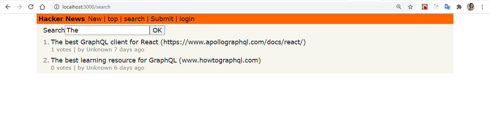
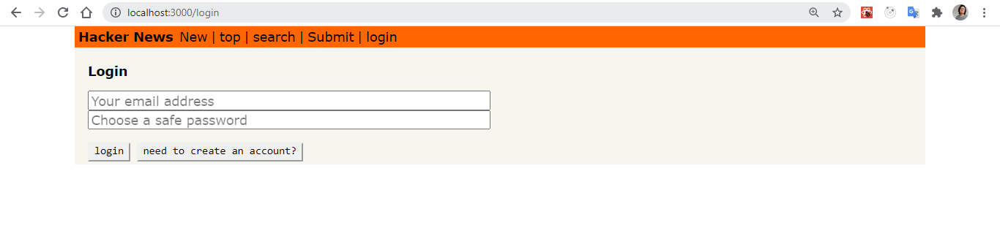
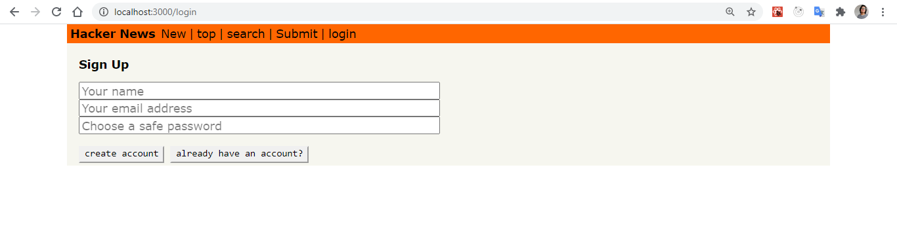

# MyHackerNews

This is a proyect was created with the tutorial "[React + Apollo Tutorial - Introduction]".

### Tech

MyHackerNew is a clone of the [HackerNews] and was created with the next technologies:

* [React]
* [Apollo]
* [GraphQL]


### Installation

Open your terminal in the root of the proyects and run the next commands 

```sh
$ npm install
$ npm run start
```
This run the app. Now we need to run the server.

Open the terminal en go to the server file

```sh
$ yarn install
$ yarn run
```

You can find the app in "http://localhost:3000/" and the server in "http://localhost:4000/"

### Screen shoots








   [React]: <https://reactjs.org/>
   [Apollo]: <https://www.apollographql.com/>
   [GraphQL]: <https://graphql.org/>
   [React + Apollo Tutorial - Introduction]: <https://www.howtographql.com/react-apollo/0-introduction/>
   [HackerNews]: <https://news.ycombinator.com/news>